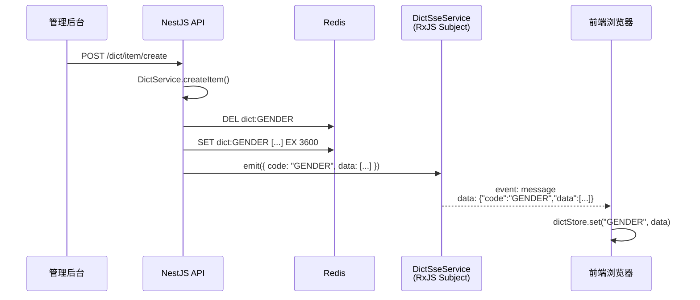

# 字典模块技术文档

> 模块路径：`src/dict/` | 版本：1.0.0 | 最后更新：2026-06-17

---

## 一、概述

字典模块为系统提供统一的键值对数据管理能力，典型场景包括：性别、订单状态、支付方式等枚举类数据的维护与查询。

核心特性：
- **双表设计**：字典类型（`DictType`）+ 字典项（`DictItem`），外键关联
- **Redis 缓存**：按 `code` 缓存字典项列表，1 小时 TTL
- **SSE 实时推送**：字典变更时主动通知所有前端客户端刷新本地数据

---

## 二、数据库设计

### 2.1 ER 图

```
┌──────────────────────┐          ┌──────────────────────┐
│     dict_type        │          │     dict_item         │
├──────────────────────┤          ├──────────────────────┤
│ id (PK)              │◄─────────│ type_id (FK)          │
│ name     VARCHAR(32) │          │ id (PK)               │
│ code     VARCHAR(64) │ UNIQUE   │ label    VARCHAR(64)   │
│ status   BOOLEAN     │          │ value    VARCHAR(64)   │
│ remark   TEXT        │ NULLABLE │ sort     INT           │
│ created_at           │          │ status   BOOLEAN       │
│ updated_at           │          │ remark   TEXT          │
└──────────────────────┘          │ created_at             │
                                  │ updated_at             │
                                  └──────────────────────┘
```

### 2.2 `dict_type`（字典类型）

| 字段         | 类型               | 说明                            |
| ------------ | ------------------ | ------------------------------- |
| `id`         | INT (PK)           | 自增主键                        |
| `name`       | VARCHAR(32)        | 字典名称，如"用户性别"          |
| `code`       | VARCHAR(64) UNIQUE | 字典编码，唯一标识，如 `GENDER` |
| `status`     | BOOLEAN            | 启用状态，默认 `true`           |
| `remark`     | TEXT               | 备注，可空                      |
| `created_at` | DATETIME           | 创建时间                        |
| `updated_at` | DATETIME           | 更新时间                        |

### 2.3 `dict_item`（字典项）

| 字段         | 类型        | 说明                  |
| ------------ | ----------- | --------------------- |
| `id`         | INT (PK)    | 自增主键              |
| `type_id`    | INT (FK)    | 关联 `dict_type.id`   |
| `label`      | VARCHAR(64) | 显示标签，如"男"      |
| `value`      | VARCHAR(64) | 字典值，如 `"0"`      |
| `sort`       | INT         | 排序号，默认 `0`      |
| `status`     | BOOLEAN     | 启用状态，默认 `true` |
| `remark`     | TEXT        | 备注，可空            |
| `created_at` | DATETIME    | 创建时间              |
| `updated_at` | DATETIME    | 更新时间              |

---

## 三、模块结构

```
src/dict/
├── dto/
│   ├── dict-type-create.dto.ts    # 创建字典类型
│   ├── dict-type-update.dto.ts    # 更新字典类型（extends CreateDto）
│   ├── dict-type-list.dto.ts      # 字典类型分页查询
│   ├── dict-item-create.dto.ts    # 创建字典项
│   └── dict-item-update.dto.ts    # 更新字典项（extends CreateDto）
├── entities/
│   ├── dict-type.entity.ts        # DictType 实体 → dict_type 表
│   └── dict-item.entity.ts        # DictItem 实体 → dict_item 表
├── dict.module.ts                 # NestJS 模块定义
├── dict.controller.ts             # 控制器（REST + SSE）
├── dict.service.ts                # 业务逻辑 + 缓存 + SSE 通知
└── dict-sse.service.ts            # SSE 事件总线（RxJS Subject）
```

---

## 四、API 端点

### 4.1 字典类型

| 方法     | 路径                         | 说明               | 认证     |
| -------- | ---------------------------- | ------------------ | -------- |
| `POST`   | `/api/dict/type/create`      | 创建字典类型       | 需登录   |
| `PATCH`  | `/api/dict/type/update`      | 编辑字典类型       | 需登录   |
| `POST`   | `/api/dict/type/list`        | 字典类型分页列表   | 需登录   |
| `GET`    | `/api/dict/type/all`         | 所有启用的字典类型 | 无需登录 |
| `DELETE` | `/api/dict/type/delete?id=1` | 删除字典类型       | 需登录   |

### 4.2 字典项

| 方法     | 路径                           | 说明                 | 认证   |
| -------- | ------------------------------ | -------------------- | ------ |
| `POST`   | `/api/dict/item/create`        | 创建字典项           | 需登录 |
| `PATCH`  | `/api/dict/item/update`        | 编辑字典项           | 需登录 |
| `GET`    | `/api/dict/item/list?typeId=1` | 字典项列表（按类型） | 需登录 |
| `DELETE` | `/api/dict/item/delete?id=1`   | 删除字典项           | 需登录 |

### 4.3 数据查询与 SSE

| 方法  | 路径                   | 说明               | 认证     |
| ----- | ---------------------- | ------------------ | -------- |
| `GET` | `/api/dict/data/:code` | 按编码获取字典数据 | 无需登录 |
| `GET` | `/api/dict/stream`     | SSE 实时推送流     | 无需登录 |

---

## 五、SSE 实时推送

### 5.1 架构图



### 5.2 核心实现

**事件总线（`dict-sse.service.ts`）**：

```typescript
@Injectable()
export class DictSseService {
  private readonly eventSubject = new Subject<MessageEvent>();

  /** 广播事件给所有 SSE 连接 */
  emit(event: DictChangePayload): void {
    this.eventSubject.next({ data: JSON.stringify(event) } as MessageEvent);
  }

  /** 获取 SSE 流 */
  getStream(): Observable<MessageEvent> {
    return this.eventSubject.asObservable();
  }
}
```

**变更触发（`dict.service.ts`）**：

```typescript
private async clearDictCacheAndNotify(code: string) {
  // 1. 清除Redis缓存
  await this.redisService.del(getRedisKey(RedisKeyPrefix.DICT, code));
  // 2. 重新加载最新数据
  const data = await this.getDictByCode(code);
  // 3. 通过SSE推送
  this.dictSseService.emit({ code, data });
}
```

### 5.3 设计要点

| 要点                  | 说明                                                                                          |
| --------------------- | --------------------------------------------------------------------------------------------- |
| **RxJS Subject 广播** | 所有 SSE 连接共享同一 `Subject`，`emit()` 一次即可推送给全部客户端                            |
| **缓存 + 推送双保险** | SSE 推送最新数据 + Redis 缓存兜底。即使用户错过 SSE 事件，下次 HTTP 请求仍能命中新缓存        |
| **不需要额外依赖**    | NestJS 原生 `@Sse()` 装饰器，自动处理 `Content-Type: text/event-stream`、keep-alive、断线重连 |
| **变更即推送**        | 创建/编辑/删除字典类型或字典项时均触发 SSE 推送                                               |

### 5.4 SSE 事件格式

```json
{
  "code": "GENDER",
  "data": [
    { "label": "男", "value": "0", "sort": 1 },
    { "label": "女", "value": "1", "sort": 2 }
  ]
}
```

---

## 六、Redis 缓存策略

| 策略项                 | 值                                                      |
| ---------------------- | ------------------------------------------------------- |
| **Key 格式**           | `dict:{code}`，如 `dict:GENDER`                         |
| **存储内容**           | `JSON.stringify([{ id, label, value, sort }])`          |
| **TTL**                | 3600 秒（1 小时）                                       |
| **失效时机**           | 字典类型/字典项发生 创建/编辑/删除 时主动 `DEL`         |
| **Redis Key 前缀定义** | `src/common/enums/redis-key.enum.ts` → `DICT = 'dict:'` |

---

## 七、前端接入指南

### 7.1 HTTP 拉取（初始加载 / 降级方案）

```typescript
// 按 code 获取字典数据
const response = await fetch('/api/dict/data/GENDER');
const items: DictItem[] = await response.json();

// items = [{ label: "男", value: "0", sort: 1 }, { label: "女", value: "1", sort: 2 }]
```

### 7.2 SSE 实时监听

```typescript
const eventSource = new EventSource('/api/dict/stream');

eventSource.onmessage = (event) => {
  const { code, data } = JSON.parse(event.data);
  // code: 变更的字典编码
  // data: 最新的字典项数组
  dictStore.set(code, data);
};

eventSource.onerror = () => {
  // 浏览器会自动重连，这里可以记录日志
  console.warn('[Dict SSE] 连接异常，将自动重连');
};
```

### 7.3 React 集成示例

```typescript
import { useEffect, useState } from 'react';

function useDictData(code: string) {
  const [items, setItems] = useState<DictItem[]>([]);

  useEffect(() => {
    // 初始加载
    fetch(`/api/dict/data/${code}`)
      .then(r => r.json())
      .then(setItems);

    // SSE 实时更新
    const es = new EventSource('/api/dict/stream');
    es.onmessage = (event) => {
      const { code: changedCode, data } = JSON.parse(event.data);
      if (changedCode === code) {
        setItems(data);
      }
    };

    return () => es.close();
  }, [code]);

  return items;
}

// 使用
function GenderSelect() {
  const genders = useDictData('GENDER');
  return (
    <select>
      {genders.map(item => (
        <option key={item.value} value={item.value}>{item.label}</option>
      ))}
    </select>
  );
}
```

---

## 八、业务约束

| 约束          | 说明                                                                                  |
| ------------- | ------------------------------------------------------------------------------------- |
| **级联保护**  | 删除字典类型前检查是否存在关联的字典项，存在则返回 400 错误                           |
| **code 唯一** | `dict_type.code` 设有 UNIQUE 约束，数据库层面保证不重复                               |
| **变更记录**  | 所有 CRUD 操作均通过 `@LogAction` 装饰器记录操作日志                                  |
| **权限控制**  | SSR 流和 `data/:code` 使用 `@AllowNoPermission()` 放行，管理类端点需要登录 + 权限校验 |

---

## 九、相关文件索引

| 文件                                    | 说明                                       |
| --------------------------------------- | ------------------------------------------ |
| `src/dict/dict.module.ts`               | 模块定义，注册 Entity、Controller、Service |
| `src/dict/dict.controller.ts`           | REST 端点 + SSE 端点                       |
| `src/dict/dict.service.ts`              | 核心业务逻辑、Redis 缓存、SSE 触发         |
| `src/dict/dict-sse.service.ts`          | RxJS Subject 事件总线                      |
| `src/dict/entities/dict-type.entity.ts` | 字典类型实体                               |
| `src/dict/entities/dict-item.entity.ts` | 字典项实体                                 |
| `src/dict/dto/*.ts`                     | 请求 DTO（create / update / list）         |
| `src/common/enums/redis-key.enum.ts`    | `DICT = 'dict:'` 前缀定义                  |
| `src/app.module.ts`                     | 注册 `DictModule`                          |
